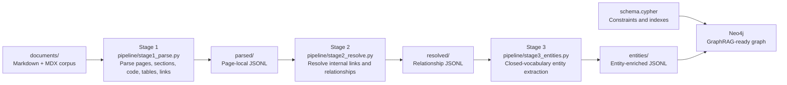
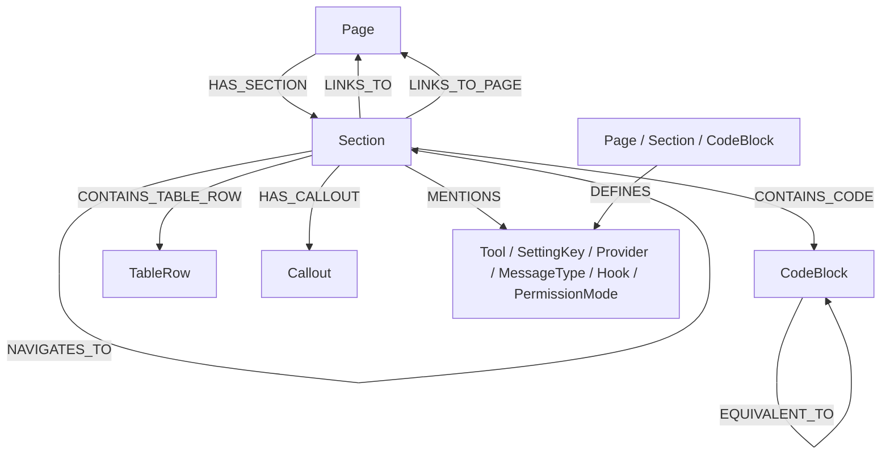

# GraphRAG Workflow ETL


This folder is the ETL segment of **GraphRAG Workflow**. It turns a Markdown/MDX documentation corpus into structured JSONL records, resolves graph relationships, enriches records with a closed-vocabulary entity catalog, and loads the result into Neo4j for GraphRAG retrieval.

The current import includes:

| Area | Count | Path |
| --- | ---: | --- |
| Corpus files | 124 | [`documents/`](documents/) |
| Parsed page artifacts | 123 | [`parsed/`](parsed/) |
| Link-resolved artifacts | 123 | [`resolved/`](resolved/) |
| Entity-enriched artifacts | 124 | [`entities/`](entities/) |
| Regression tests | 15 | [`tests/`](tests/) |

## Pipeline Map



## Graph Shape



## Directory Map

| Path | Purpose |
| --- | --- |
| [`pipeline/`](pipeline/) | ETL implementation modules. |
| [`checks/`](checks/) | Runnable checks for parse quality, relationship quality, Neo4j config, and loader behavior. |
| [`tests/`](tests/) | Fast regression tests for parser and resolver behavior. |
| [`documents/`](documents/) | Source Markdown/MDX corpus and `llms.txt` descriptions. |
| [`parsed/`](parsed/) | Stage 1 JSONL output. |
| [`resolved/`](resolved/) | Stage 2 JSONL output with relationship records. |
| [`entities/`](entities/) | Stage 3 JSONL output plus `_entities.jsonl`. |
| [`schema.cypher`](schema.cypher) | Neo4j constraints, lookup indexes, vector indexes, and full-text indexes. |
| [`requirements.txt`](requirements.txt) | Python dependencies for ETL and Neo4j loading. |

## Quickstart

Run these commands from this `ETL/` directory.

```powershell
python -m venv .venv
.\.venv\Scripts\Activate.ps1
python -m pip install -r requirements.txt pytest
python -m pytest tests
```

Expected test result:

```text
15 passed
```

## Run The ETL

Run the stages in order when rebuilding the artifacts from `documents/`.

```powershell
python -m pipeline.stage1_parse
python -m pipeline.stage2_resolve
python -m pipeline.stage3_entities
```

To parse a single source page:

```powershell
python -m pipeline.stage1_parse en/quickstart.md
```

To send output to custom directories:

```powershell
python -m pipeline.stage1_parse --out parsed
python -m pipeline.stage2_resolve --in parsed --out resolved
python -m pipeline.stage3_entities --in resolved --out entities
```

## Neo4j Configuration

The Neo4j loader reads connection settings from environment variables or command-line flags. Prefer environment variables so secrets do not land in shell history.

```powershell
$env:NEO4J_URI = "neo4j://localhost:7687"
$env:NEO4J_USER = "neo4j"
$env:NEO4J_PASSWORD = "<password>"
$env:NEO4J_DATABASE = "neo4j"
```

Do not commit `.env` or `.env.*` files. They are intentionally ignored at the repository root.

## Load Neo4j

First check the connection:

```powershell
python -m pipeline.stage6_load_neo4j check
```

Apply schema:

```powershell
python -m pipeline.stage6_load_neo4j schema
```

Dry-run the loader:

```powershell
python -m pipeline.stage6_load_neo4j load --dry-run
```

Load the entity-enriched corpus:

```powershell
python -m pipeline.stage6_load_neo4j load
```

Wipe loader-owned graph nodes only when you intentionally want a clean reload:

```powershell
python -m pipeline.stage6_load_neo4j wipe --yes
```

## Stage Details

<details>
<summary><strong>Stage 1: Parse Markdown/MDX to JSONL</strong></summary>

`pipeline/stage1_parse.py` reads files under `documents/en/` and emits one JSONL file per page under `parsed/`.

It extracts:

- page records
- sections and stable anchors
- section text
- code blocks
- table rows
- callouts
- raw links

Useful commands:

```powershell
python -m pipeline.stage1_parse
python -m pipeline.stage1_parse en/quickstart.md
python checks/check_parse.py
```

</details>

<details>
<summary><strong>Stage 2: Resolve Links and Relationships</strong></summary>

`pipeline/stage2_resolve.py` reads `parsed/`, builds a page and section catalog, resolves internal links, emits relationship records, and keeps unresolved internal links as diagnostics instead of failing the full run.

It emits relationships such as:

- `HAS_SECTION`
- `HAS_SUBSECTION`
- `CONTAINS_CODE`
- `CONTAINS_TABLE_ROW`
- `HAS_CALLOUT`
- `LINKS_TO`
- `LINKS_TO_PAGE`
- `NAVIGATES_TO`
- `EQUIVALENT_TO`

Useful commands:

```powershell
python -m pipeline.stage2_resolve
python checks/check_links.py
```

</details>

<details>
<summary><strong>Stage 3: Extract Closed-Vocabulary Entities</strong></summary>

`pipeline/stage3_entities.py` reads `resolved/`, appends closed-catalog entity nodes, and adds entity relationships without using open-ended generic NER.

Entity labels include:

- `Tool`
- `SettingKey`
- `Provider`
- `MessageType`
- `Hook`
- `PermissionMode`

Useful commands:

```powershell
python -m pipeline.stage3_entities
python checks/check_entities.py
```

</details>

<details>
<summary><strong>Stage 6: Load Neo4j</strong></summary>

`pipeline/stage6_load_neo4j.py` is the command-line entrypoint for Neo4j connectivity, schema application, dry-runs, loading, and wiping loader-owned labels.

The implementation is split across:

- [`pipeline/neo4j_connector.py`](pipeline/neo4j_connector.py) for connection/config/schema utilities.
- [`pipeline/stage6_load.py`](pipeline/stage6_load.py) for mapping JSONL records to Neo4j nodes and relationships.
- [`schema.cypher`](schema.cypher) for constraints and indexes.

Useful commands:

```powershell
python -m pipeline.stage6_load_neo4j check
python -m pipeline.stage6_load_neo4j schema
python -m pipeline.stage6_load_neo4j load --dry-run
python -m pipeline.stage6_load_neo4j load
```

</details>

## Verification

Fast local verification:

```powershell
python -m pytest tests
python checks/check_parse.py
python checks/check_links.py
python checks/check_entities.py
python checks/check_load_logic.py
python checks/check_neo4j_config.py
```

Neo4j-backed verification requires a running database and valid Neo4j environment variables:

```powershell
python checks/check_neo4j.py
python checks/check_load.py
```

## Troubleshooting

| Symptom | Check |
| --- | --- |
| `no JSONL files found` | Run the previous stage first, or pass `--in` to the directory containing the expected artifacts. |
| Missing Neo4j password | Set `NEO4J_PASSWORD` or pass `--password` for local one-off use. |
| Broken internal links | Run `python checks/check_links.py` and inspect `unresolved_link` diagnostics in `resolved/`. |
| Loader refuses to wipe | Add `--yes` only when you intentionally want to delete loader-owned labels. |
| Vector indexes need a different dimension | Update `schema.cypher` before applying schema if the embedding model dimension changes. |

## Development Notes

- Keep `.env`, `.env.*`, and assistant-local files out of commits.
- Keep generated ETL artifacts deterministic when changing parser or resolver behavior.
- Add focused regression tests in [`tests/test_etl_regressions.py`](tests/test_etl_regressions.py) for parsing and resolving edge cases.
- Stage 4/5 embedding work belongs to the contextual embeddings workflow segment; this ETL prepares the structured graph inputs and Neo4j schema.
