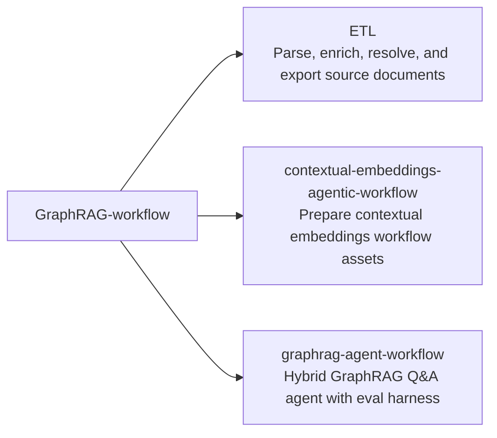
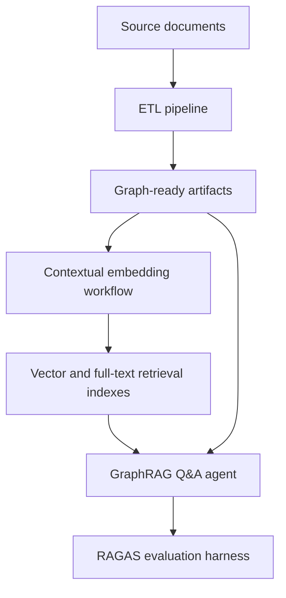
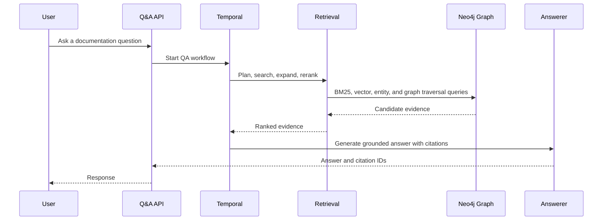

# GraphRAG Workflow

GraphRAG Workflow is a monorepo for an end-to-end retrieval and agent workflow.
It is organized into three top-level segments: document ETL, contextual
embedding preparation, and a GraphRAG Q&A agent.

## Repository Map



## Workflow



## Segments

| Segment | Purpose |
| --- | --- |
| [`ETL/`](ETL/) | Pipeline code, checks, source documents, parsed outputs, resolved entities, and graph-ready artifacts. |
| [`contextual-embeddings-agentic-workflow/`](contextual-embeddings-agentic-workflow/) | Contextual embedding workflow assets used between document processing and retrieval. |
| [`graphrag-agent-workflow/`](graphrag-agent-workflow/) | GraphRAG Q&A agent with Temporal workflow wiring, hybrid retrieval, entity lookup, graph expansion, reranking, tests, and RAGAS evaluation support. |

## Agent Retrieval Path



## Run via Docker Compose

A full-stack `docker compose` distribution is included so you can clone and run
the system end-to-end without a host Python or Neo4j install.

### Prerequisites

- Docker Desktop or Docker Engine 24+ with Compose v2.
- ~6 GB free disk for images, Neo4j data, and the Ollama embedding model.
- An OpenAI API key (used by the planner and answerer).
- Optionally, a Cohere API key for reranking; if omitted the workflow falls
  back to RRF top-8.

### One-time setup

```bash
cp .env.example .env
# Edit .env and fill in OPENAI_API_KEY (and optionally COHERE_API_KEY).
docker compose config > /dev/null   # cheap pre-flight: validates YAML + env interpolation
```

### Start the stack

```bash
docker compose up
```

On the first run, two one-shot containers seed the system:

- `neo4j-seed` downloads the published Neo4j dump, verifies its SHA-256, and
  restores it into the `neo4j-data` volume. The dump is ~298 MB; the URL and
  checksum are pinned in `.env.example`.
- `ollama-seed` waits for the Ollama service and pulls the embedding model
  configured in `EMBEDDING_MODEL`.

Both seed steps are idempotent and skip on subsequent `docker compose up` runs.

### Use the chat UI

Open [`http://localhost:8000`](http://localhost:8000) in a browser. Ask a
question about the Claude Code documentation. The answer renders in the chat
window; supporting citations appear as expandable elements in the side panel.

Other exposed endpoints:

- Neo4j Browser: [`http://localhost:7474`](http://localhost:7474) (user
  `neo4j`, password from `NEO4J_PASSWORD`)
- Temporal UI: [`http://localhost:8233`](http://localhost:8233)

### Smoke test

After bring-up, validate the stack:

1. `docker compose ps` — every long-running service is `Up (healthy)`;
   `neo4j-seed` and `ollama-seed` are `Exited (0)`.
2. Open `http://localhost:8000`, ask: *"How do I configure the Bash tool's
   permission mode?"* — expect an answer plus at least one citation in the
   side panel within ~30 seconds.
3. `docker compose down && docker compose up` — second startup is fast because
   the seed containers detect their marker / model and skip.

### Stop the stack

```bash
docker compose down              # stop containers, keep data volumes
docker compose down -v           # stop and wipe volumes (forces re-seed)
```

### Note on configuration scope

`OPENAI_API_KEY` and `COHERE_API_KEY` are mounted only into `qa-api` and
`qa-worker` via `env_file: .env`. Chainlit, Neo4j, Ollama, and the seed
containers never see them.
