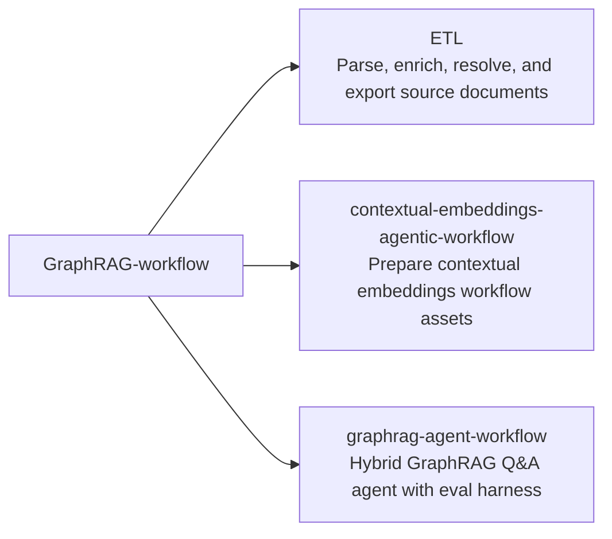
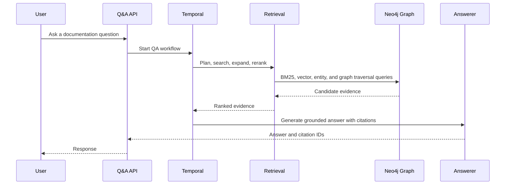

# GraphRAG Workflow

GraphRAG Workflow is a monorepo for an end-to-end retrieval and agent workflow.
It is organized into three top-level segments: document ETL, contextual
embedding preparation, and a GraphRAG Q&A agent.

## Repository Map



## Workflow

```mermaid
flowchart TD
    docs["Source documents"] --> etl["ETL pipeline"]
    etl --> graph["Graph-ready artifacts"]
    graph --> contextual["Contextual embedding workflow"]
    contextual --> indexes["Vector and full-text retrieval indexes"]
    indexes --> agent["GraphRAG Q&A agent"]
    graph --> agent
    agent --> evals["RAGAS evaluation harness"]
```

## Segments

| Segment | Purpose |
| --- | --- |
| [`ETL/`](ETL/) | Pipeline code, checks, source documents, parsed outputs, resolved entities, and graph-ready artifacts. |
| [`contextual-embeddings-agentic-workflow/`](contextual-embeddings-agentic-workflow/) | Contextual embedding workflow assets used between document processing and retrieval. |
| [`graphrag-agent-workflow/`](graphrag-agent-workflow/) | GraphRAG Q&A agent with Temporal workflow wiring, hybrid retrieval, entity lookup, graph expansion, reranking, tests, and RAGAS evaluation support. |

## Agent Retrieval Path


