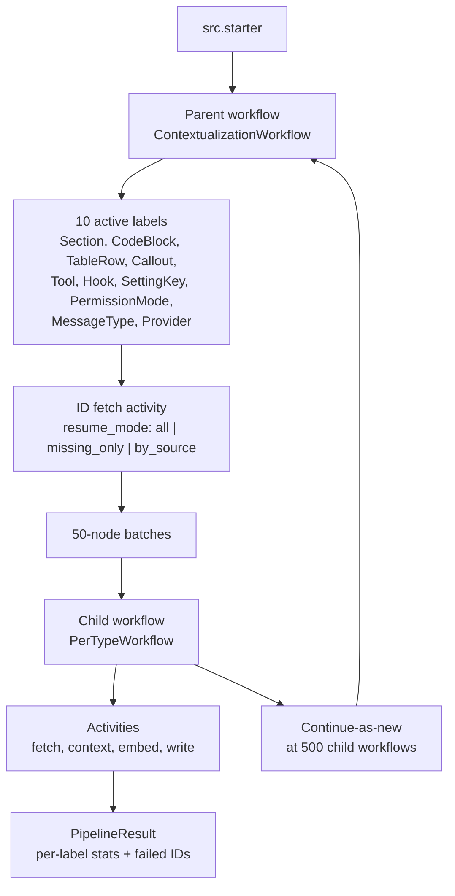
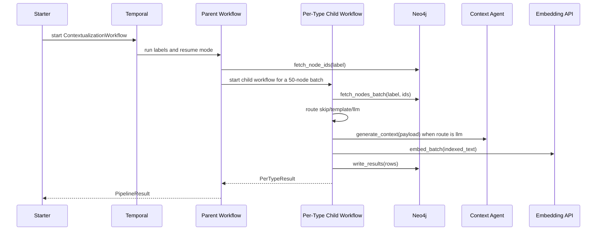

# Contextual Embeddings Agentic Workflow


This segment is the contextual enrichment and embedding workflow for **GraphRAG Workflow**. It reads graph nodes produced by the ETL segment, generates concise retrieval context, builds `indexed_text`, creates embeddings, and writes the enriched properties back to Neo4j.

The implementation lives in [`contextual_pipeline/`](contextual_pipeline/). It is built as a Temporal workflow so long enrichment jobs can be retried, resumed, and processed by label-specific child workflows.

## What It Writes

| Property | Purpose |
| --- | --- |
| `context` | Short contextual summary used to explain why a graph node matters. |
| `indexed_text` | Search-ready text made from context plus the raw node representation. |
| `embedding` | Vector generated from `indexed_text`. |
| `context_source` | Provenance marker: `llm`, `template`, or `skipped`. |
| `context_version` | Integer version used to track enrichment runs. |

## Pipeline Map

```mermaid
flowchart LR
    neo4j_in["Neo4j graph\nETL nodes + relationships"]
    starter["src/starter.py\nStart run, pilot, labels, resume mode"]
    temporal["Temporal server\ncontextual-pipeline task queue"]
    parent["ContextualizationWorkflow\nIterate active labels"]
    ids["fetch_node_ids\nFind candidate node IDs"]
    child["PerTypeWorkflow\nBatch label-specific work"]
    fetch["fetch_nodes_batch\nHydrate NodePayload records"]
    route{"decide_route"}
    skip["skip\nempty indexed fields"]
    template["template\nfast deterministic context"]
    llm["generate_context\nagentic LLM context"]
    embed["embed_batch\nOpenAI-compatible embeddings"]
    write["write_results\nidempotent Neo4j SET"]
    neo4j_out["Neo4j graph\ncontext + indexed_text + embedding"]

    neo4j_in --> starter --> temporal --> parent --> ids --> child --> fetch --> route
    route --> skip --> write
    route --> template --> embed --> write
    route --> llm --> embed --> write
    write --> neo4j_out
```



## Workflow Topology



## Data Flow



## Directory Map

| Path | Purpose |
| --- | --- |
| [`contextual_pipeline/src/workflows/`](contextual_pipeline/src/workflows/) | Temporal parent and per-label child workflows. |
| [`contextual_pipeline/src/activities/`](contextual_pipeline/src/activities/) | Neo4j fetch, context generation, embedding, and write activities. |
| [`contextual_pipeline/src/agents/`](contextual_pipeline/src/agents/) | Pydantic AI context-generation agent. |
| [`contextual_pipeline/src/cypher/`](contextual_pipeline/src/cypher/) | Query files for selecting nodes, hydrating payloads, and writing enrichment results. |
| [`contextual_pipeline/src/prompts/`](contextual_pipeline/src/prompts/) | Label-specific prompts for context generation. |
| [`contextual_pipeline/scripts/`](contextual_pipeline/scripts/) | Smoke, pilot, and verification scripts. |
| [`contextual_pipeline/tests/`](contextual_pipeline/tests/) | Contract, routing, Cypher safety, retry, and workflow tests. |
| [`contextual_pipeline/pyproject.toml`](contextual_pipeline/pyproject.toml) | Python package metadata and dependencies. |
| [`docs/superpowers/plans/`](docs/superpowers/plans/) | Historical implementation plans for this segment. |

## Quickstart

Run these commands from [`contextual_pipeline/`](contextual_pipeline/).

```powershell
cd contextual-embeddings-agentic-workflow\contextual_pipeline
python -m venv .venv
.\.venv\Scripts\Activate.ps1
python -m pip install -e ".[dev]"
```

Fast verification:

```powershell
$env:NEO4J_PASSWORD = "test-password"
$env:OPENAI_API_KEY = "test-openai-key"
python -m compileall -q src tests scripts
python -m pytest -q
```

Expected test result:

```text
109 passed
```

## Environment

Configuration is read with `pydantic-settings`. Keep real values in `.env` or your shell environment. Do not commit `.env`, `.env.*`, run logs, virtual environments, or cache folders.

Required runtime variables:

| Variable | Purpose |
| --- | --- |
| `NEO4J_URI` | Neo4j connection URI. |
| `NEO4J_USER` | Neo4j username. |
| `NEO4J_PASSWORD` | Neo4j password. |
| `OPENAI_API_KEY` | API key for the configured OpenAI-compatible LLM provider. |
| `LLM_MODEL` | Context-generation model name. |
| `EMBEDDING_BASE_URL` | OpenAI-compatible embeddings endpoint. |
| `EMBEDDING_MODEL` | Embedding model name. |
| `TEMPORAL_HOST` | Temporal frontend address. |
| `TEMPORAL_NAMESPACE` | Temporal namespace. |
| `CONTEXT_VERSION` | Integer enrichment version written to Neo4j. |

Optional tuning variables:

| Variable | Default | Purpose |
| --- | ---: | --- |
| `EMBEDDING_BATCH_SIZE` | `32` | Number of texts per embedding request. |
| `LLM_BATCH_SIZE` | `8` | Reserved batch tuning setting for LLM work. |

## Run The Worker

Start a Temporal worker from `contextual_pipeline/`:

```powershell
python -m src.worker
```

After code changes, stop and restart the worker before starting another workflow. Temporal workers load workflow/activity code at process startup.

## Start A Workflow

Run a small pilot first:

```powershell
python -m src.starter --pilot 50 --labels CodeBlock
```

Run all configured labels:

```powershell
python -m src.starter
```

Resume only missing contexts:

```powershell
python -m src.starter --resume missing_only
```

Re-process only selected context sources:

```powershell
python -m src.starter --resume by_source --sources llm
```

Run selected labels only:

```powershell
python -m src.starter --labels Section CodeBlock Tool
```

## Stage Details

<details>
<summary><strong>1. Fetch Candidate IDs</strong></summary>

`src.activities.fetch.fetch_node_ids` selects candidate node IDs for a label using Cypher under `src/cypher/fetch_ids/`.

Supported labels:

- `Section`
- `CodeBlock`
- `TableRow`
- `Callout`
- `Tool`
- `Hook`
- `SettingKey`
- `PermissionMode`
- `MessageType`
- `Provider`

Resume modes:

- `all`: process all matching nodes.
- `missing_only`: process only nodes without context.
- `by_source`: process nodes whose `context_source` is in `--sources`.

</details>

<details>
<summary><strong>2. Hydrate Node Payloads</strong></summary>

`src.activities.fetch.fetch_nodes_batch` loads full node payloads using Cypher under `src/cypher/fetch_nodes/`.

The activity converts Neo4j rows into `NodePayload` records with:

- `node_id`
- `label`
- `raw_text`
- page and breadcrumb context
- parent text
- related hints
- label-specific extras

</details>

<details>
<summary><strong>3. Route Context Work</strong></summary>

`src.routing.decide_route` decides whether each node should be skipped, templated, or sent to the context-generation agent.

The routing keeps obvious empty/trivial records cheap, uses deterministic templates for predictable long structures, and reserves LLM calls for nodes that need richer semantic context.

Routes:

- `skip`: write empty context/indexed text and `context_source = skipped`.
- `template`: create context locally and embed it.
- `llm`: call the context agent, then embed the result.

</details>

<details>
<summary><strong>4. Generate Context</strong></summary>

`src.activities.generate_context.generate_context` calls the context agent and validates the response with Pydantic models.

The retry chain handles schema validation and transient provider errors while marking non-retryable model behavior as a workflow-visible failure for the node.

Prompts live in [`contextual_pipeline/src/prompts/`](contextual_pipeline/src/prompts/).

</details>

<details>
<summary><strong>5. Embed Indexed Text</strong></summary>

`src.activities.embed.embed_batch` sends `indexed_text` batches to the configured OpenAI-compatible embeddings endpoint.

The default local endpoint is:

```text
http://localhost:11434/v1
```

The default embedding model is:

```text
qwen3-embedding:0.6b
```

</details>

<details>
<summary><strong>6. Write Results To Neo4j</strong></summary>

`src.activities.write.write_results` applies `src/cypher/write_context.cypher`.

Writes are idempotent `SET` operations keyed by label and node ID. Re-running the same batch overwrites the same final enrichment properties instead of creating duplicates.

</details>

## Verification Queries

Check context and indexed text coverage for a pilot:

```cypher
MATCH (c:CodeBlock) WHERE c.indexed_text IS NOT NULL
RETURN count(c) AS count,
       avg(size(c.indexed_text)) AS avg_indexed_text_len,
       avg(size(c.context)) AS avg_context_len;
```

Check embedding dimensions:

```cypher
MATCH (c:CodeBlock) WHERE c.embedding IS NOT NULL
RETURN size(c.embedding) AS dim, count(*) AS count
LIMIT 1;
```

Check full-text retrieval:

```cypher
CALL db.index.fulltext.queryNodes('codeblock_fulltext', 'permission')
YIELD node, score
RETURN node.id, score
LIMIT 5;
```

Check vector retrieval:

```cypher
MATCH (c:CodeBlock) WHERE c.embedding IS NOT NULL
WITH c LIMIT 1
CALL db.index.vector.queryNodes('codeblock_embedding', 5, c.embedding)
YIELD node, score
RETURN node.id, score;
```

## Troubleshooting

| Symptom | Check |
| --- | --- |
| Tests fail during collection with missing settings | Set dummy `NEO4J_PASSWORD` and `OPENAI_API_KEY` for local tests. |
| Worker cannot connect | Verify `TEMPORAL_HOST`, `TEMPORAL_NAMESPACE`, and that Temporal is running. |
| No nodes selected | Check the label name and resume mode, then inspect the matching `fetch_ids/*.cypher` file. |
| Embeddings fail | Verify `EMBEDDING_BASE_URL` and `EMBEDDING_MODEL`; the endpoint must speak the OpenAI embeddings API. |
| Writes update fewer rows than expected | Inspect `write_context.cypher` and confirm each row has the label-specific primary key expected by Neo4j. |
| Re-run needed after code changes | Restart the Temporal worker, then start a fresh workflow. |

## Development Notes

- Keep public commits free of `.env`, `.env.*`, `CLAUDE.md`, `*.log`, virtual environments, and caches.
- Keep Cypher changes covered by `tests/test_cypher_safety.py`.
- Keep route changes covered by `tests/test_routing.py`.
- Keep context-agent contract changes covered by `tests/test_context_agent_contract.py`.
- Stage this segment after ETL has loaded the base graph and indexes into Neo4j.
